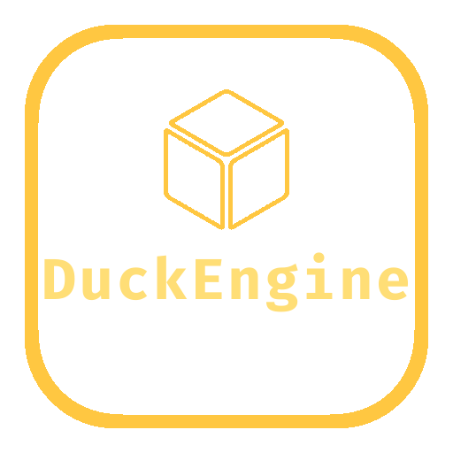

# 

[Demos](#demos)


[](https://wakatime.com/badge/github/ksplatdev/DuckEngine)


[](https://github.com/prettier/prettier)

2D Game Library for the web.

## Features

1. Physics
2. Sprites
3. Many Game objects
4. Group Management
5. Keyboard, Mouse, and touch input
6. Storage
7. Tilemaps
8. Particles
9. Sound player with sound sprites
10. Scenes
11. Cameras
12. Multi-Camera Switching
13. Scene Unique Stack / Entity Manager
14. Game Stack / Global Scene Manager
15. Animations
16. Cutscenes
17. Custom loader to load from URL or file path
18. [Docs](https://ksplatdev.github.io/DuckEngine/)
19. Written in typescript
20. Types are included
21. And way more

## Download

### Github

1. Download the [latest release](https://github.com/ksplatdev/DuckEngine/releases/latest).
2. Set up webpack pr parcel.
3. Import DuckEngine.
4. Read the [docs](https://ksplatdev.github.io/DuckEngine/).

### NPM

1. Run `npm install duckengine`.
2. Set up webpack or parcel.
3. Import DuckEngine.
4. Read the [docs](https://ksplatdev.github.io/DuckEngine/).

## [Docs](https://ksplatdev.github.io/DuckEngine/)

## Typescript

How to use DuckEngine with Typescript.

1. Setup webpack/parcel and tsconfig.
2. Add the following to your tsconfig compilerOptions. *(not required)*
3. Import DuckEngine and Duck for types.

```json
{
    "typeRoots": [
        "./node_modules/@types",
        "path_to_duckengine_index.d.ts"
    ],
    "types": [
        "DuckEngine"
    ]
}
```

### Duck Namespace

The Duck Namespace has types such as gameobject, every class config, and more.

### [Example](examples/ts/myScene.ts)

## Developers' Guide

### Requirements

1. Knowledge of TypeScript, Git, and HTML Canvas.
2. Reading and agreeing to the [Contributing](CONTRIBUTING.md) and [Code of Conduct](CODE_OF_CONDUCT.md).
3. Basic knowledge of how DuckEngine works.

### File Structure

```bash
.
├── CHANGELOG.md
├── CODE_OF_CONDUCT.md
├── CONTRIBUTING.md
├── examples
│   ├── README.md
│   └── ts
│       ├── myScene.ts
│       └── test.ts
├── global
│   ├── Logo.png
│   ├── Logo.xcf
│   └── README.md
├── LICENSE
├── package.json
├── package-lock.json
├── README.md
├── scripts
│   └── build.sh
├── SECURITY.md
├── src
│   ├── base
│   │   └── render.ts
│   ├── core
│   │   ├── camera
│   │   │   └── camera.ts
│   │   ├── cutscene
│   │   │   └── cutscene.ts
│   │   ├── debug
│   │   │   └── debug.ts
│   │   ├── gameobjects
│   │   │   ├── circle.ts
│   │   │   ├── gameObject.ts
│   │   │   ├── rect.ts
│   │   │   ├── roundrect.ts
│   │   │   └── sprite.ts
│   │   ├── game.ts
│   │   ├── group
│   │   │   └── group.ts
│   │   ├── input
│   │   │   └── input.ts
│   │   ├── interactive
│   │   │   └── text.ts
│   │   ├── lights
│   │   │   └── staticLight.ts
│   │   ├── loader
│   │   │   └── loader.ts
│   │   ├── map
│   │   │   └── tilemap.ts
│   │   ├── math
│   │   │   └── clamp.ts
│   │   ├── particles
│   │   │   ├── particleEmitter.ts
│   │   │   └── particle.ts
│   │   ├── physics
│   │   │   ├── circleToRectIntersect.ts
│   │   │   ├── collider.ts
│   │   │   └── rectToRectIntersect.ts
│   │   ├── scene.ts
│   │   ├── sound
│   │   │   └── sound.ts
│   │   └── storage
│   │       └── storage.ts
│   ├── helper
│   │   ├── color
│   │   │   ├── getValuesHSL.ts
│   │   │   ├── getValuesRGB.ts
│   │   │   ├── hexToHSL.ts
│   │   │   ├── hexToRGBA.ts
│   │   │   ├── hexToRGB.ts
│   │   │   ├── hslaToRGBA.ts
│   │   │   ├── hslToRGB.ts
│   │   │   ├── isHex.ts
│   │   │   ├── isHSL.ts
│   │   │   ├── isRGB.ts
│   │   │   ├── randomColor.ts
│   │   │   ├── rgbaToHSLA.ts
│   │   │   ├── rgbaToRGB.ts
│   │   │   ├── rgbToHSL.ts
│   │   │   └── rgbToRGBA.ts
│   │   ├── startup.ts
│   │   └── version.ts
│   ├── index.ts
│   └── utils
│       ├── randomInt.ts
│       └── validURL.ts
├── tsconfig.json
└── webpack.config.js
```

#### Meaning & Use

1. src - Typescript files, main directory
2. lib - Javascript files, compiled from src
3. dist - Javascript & type declaration files, bundled with webpack from lib
4. global - Global Assets

### How to contribute

1. Reading and agree to the [Contributing](CONTRIBUTING.md) and [Code of Conduct](CODE_OF_CONDUCT.md).
2. Fork the repository.
3. Clone the fork to your computer.
4. CD into the cloned directory.
5. Run `npm install`.
6. Run `npm run build`.
7. Make your changes.
8. Test your changes on codesandbox by forking this [codesandbox](https://codesandbox.io/s/duckengine-test-7gfbt?file=/src/scene.js) and updating the duckengine.js file.
9. Create a pull request.

### NPM Scripts

1. `npm run test` - Opens the [codesandbox test](#live-demo-with-parcel).
2. `npm run build` - Compiles typescript, bundles files, creates minified version, builds docs, and copies package.json to dist.
3. `npm run build:docs` - Uses TypeDoc to build docs.
4. `npm run webpack` - Bundles files in lib directory.
5. `npm run minify` - Uses uglifyjs to minify bundled file.
6. `npm run format` - Uses Prettier to format files.
7. `npm run format:watch` - Watches for changes and formats once changes are saved.
8. `npm run lint` - Uses ESLint to lint all files in the src directory.
9. `npm run lint:watch` - Watches for changes and fixes all fixable issues found by ESLint.
10. `npm run lint:fix` - Uses ESLint to fix all fixable issues found by ESLint.

### Branches

1. main - main branch
2. staging - stage changes to this branch

## Versions

DuckEngine does follow SemVer.

## Demos

All demos are bundled with parcel-bundler and are all on codesandbox.

### [Space Shooter Game](https://codesandbox.io/s/duckengine-space-shooter-64wkg?file=/src/scene.js)

### [Test Template](https://codesandbox.io/s/duckengine-test-7gfbt?file=/src/scene.js)

### [Particle Test](https://codesandbox.io/s/duckengine-particle-test-dhcr1?file=/src/scene.js)

## Attribution

Cube (Cube found in logo) by José Manuel de Laá from the Noun Project.

## License

[MIT](LICENSE)
